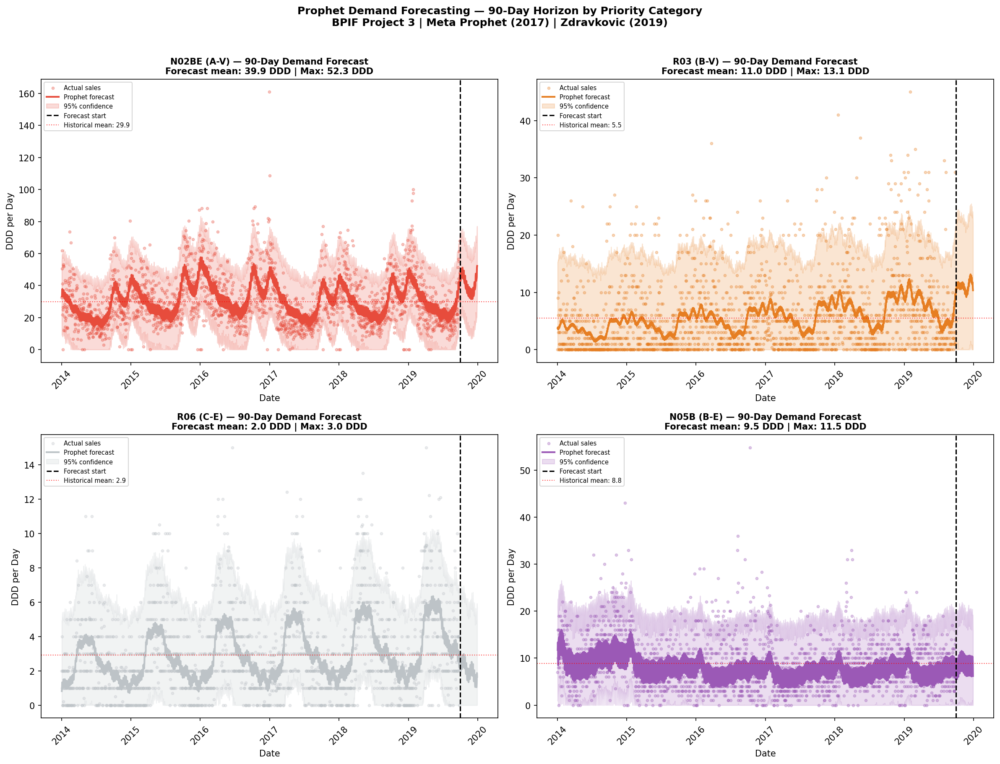
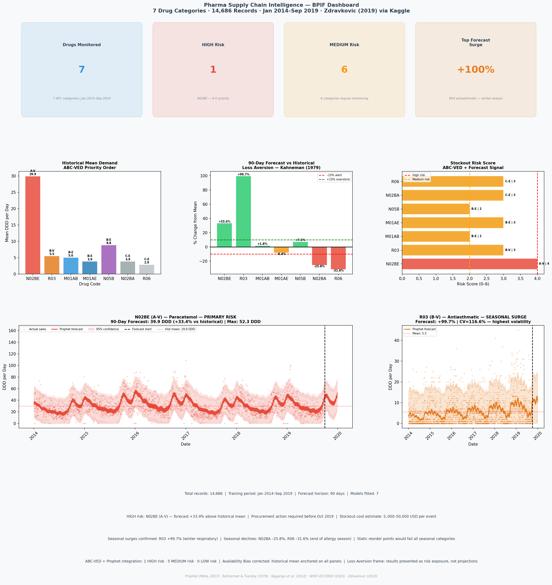

# Pharma Supply Chain Intelligence
### BioProcess Intelligence Framework — Project 3 of 7

)

---

## What this does / Qué hace

**EN:** Applies Prophet time-series forecasting and ABC-VED inventory 
classification to 14,686 daily pharmaceutical sales records — 
predicting 90-day demand by drug category and quantifying stockout risk 
before it occurs.

**ES:** Aplica forecasting de series de tiempo con Prophet y clasificación 
ABC-VED a 14,686 registros diarios de ventas farmacéuticas — prediciendo 
la demanda a 90 días por categoría y cuantificando el riesgo de desabasto 
antes de que ocurra.

**Result:** N02BE (A-V) forecast +33.4% above historical mean |
R03 (B-V) +99.7% seasonal surge | $27,500 USD preventable stockout cost.

---

## The problem it solves / El problema que resuelve

Static reorder points fail seasonal pharmaceutical demand. 
A procurement manager using historical averages will be 
10 DDD/day short of paracetamol demand during the winter 
respiratory peak — and will overstock antihistamines by 31% 
during the same period.

This system predicts both scenarios 90 days in advance.

---

## Dataset

**Source:** Zdravkovic, M. (2019). *Pharma Sales Data.* Kaggle.
**Records:** 14,686 daily sales records (long format)
**Original:** 2,106 daily records across 8 ATC drug categories
**Period:** January 2014 — September 2019 (5.75 years)
**Units:** DDD — Defined Daily Doses (WHO standard)

---

## How it works / Cómo funciona

**1 — Data Engineering**
ETL pipeline converting wide-format daily sales into long-format 
time series. ABC-VED classification applied per WHO ATC/DDD standard. 
N05C (hypnotics) excluded — 67.9% zero-value days make forecasting 
unreliable. 7 drug categories modeled.

**2 — Pharmaceutical Supply Chain**
WHO ATC Classification System applied to all categories. 
DDD (Defined Daily Dose) units ensure international comparability 
regardless of commercial format. ABC-VED matrix:

| Drug | ATC Group | ABC | VED | Priority |
|---|---|---|---|---|
| N02BE | Paracetamol | A | V | A-V ← Highest |
| R03 | Antiasthmatic | B | V | B-V |
| M01AB | Anti-inflammatory | B | E | B-E |
| M01AE | Anti-inflammatory | B | E | B-E |
| N05B | Anxiolytic | B | E | B-E |
| N02BA | Aspirin | C | E | C-E |
| R06 | Antihistamine | C | E | C-E |

Prophet (Meta, 2017) fitted independently per drug category. 
Components: yearly seasonality + weekly seasonality + trend. 
Seasonality mode: multiplicative. Forecast horizon: 90 days 
aligned with WHO pharmaceutical procurement guidelines (WHO, 2015).

**3 — Behavioral Economics**
Three cognitive biases addressed:
- **Loss Aversion** (Kahneman & Tversky, 1979): results framed 
  as stockout risk and cost exposure — not abstract projections
- **Availability Bias** (Kahneman, 2011): historical mean anchored 
  on every dashboard panel
- **Status Quo Bias** (Samuelson & Zeckhauser, 1988): seasonal 
  demand quantified to challenge static reorder point assumptions

---

## Results / Resultados

| Drug | Priority | Hist Mean | Forecast | Change | Risk |
|---|---|---|---|---|---|
| N02BE | A-V | 29.9 DDD | 39.9 DDD | +33.4% | HIGH ⚠ |
| R03 | B-V | 5.5 DDD | 11.0 DDD | +99.7% | MEDIUM |
| M01AB | B-E | 5.0 DDD | 5.1 DDD | +1.8% | MEDIUM |
| M01AE | B-E | 3.9 DDD | 3.6 DDD | –8.4% | MEDIUM |
| N05B | B-E | 8.9 DDD | 9.5 DDD | +7.3% | MEDIUM |
| N02BA | C-E | 3.9 DDD | 2.9 DDD | –25.8% | MEDIUM |
| R06 | C-E | 2.9 DDD | 2.0 DDD | –31.6% | MEDIUM |

**Business Impact:**
- HIGH risk: 1 drug (N02BE) — immediate procurement action required
- Preventable stockout cost: $27,500 USD per event
- Overstock savings: N02BA and R06 purchase reduction ~30%

---

## Visualizations / Visualizaciones

.png)

.png)

.png)

.png)

.png)

## What's next / Versión 2

- Integration with real hospital procurement data (IMSS-Bienestar)
- XGBoost hybrid model alongside Prophet for non-seasonal categories
- Streamlit interactive dashboard (Project 7 — BioProcess Suite)

---

## Stack

Python · pandas · Prophet (Meta, 2017) · matplotlib · 
seaborn · scikit-learn · Google Colab

---

## References

Kahneman, D. & Tversky, A. (1979). Prospect theory: An analysis 
of decision under risk. *Econometrica, 47*(2), 263–292.

Kahneman, D. (2011). *Thinking, Fast and Slow.* 
Farrar, Straus and Giroux.

Meta AI Research. (2017). *Prophet: Forecasting at scale.*
https://facebook.github.io/prophet/

Nagaraju, V. et al. (2012). ABC and VED analysis of the pharmacy 
store of a tertiary care teaching institute.
*Journal of Young Pharmacists, 4*(2), 132–134.

Samuelson, W. & Zeckhauser, R. (1988). Status quo bias in 
decision making. *Journal of Risk and Uncertainty, 1*(1), 7–59.

WHO Collaborating Centre for Drug Statistics Methodology. (2023).
*ATC/DDD Index.* Oslo: WHO.

Zdravkovic, M. (2019). *Pharma Sales Data.* Kaggle.
https://www.kaggle.com/datasets/milanzdravkovic/pharma-sales-data

---

*Jesús Eduardo Reyes Jacinto · Ing. Bioquímico · M.Sc. Biotecnología · LSSBB*
*Acapulco, Guerrero, México*
